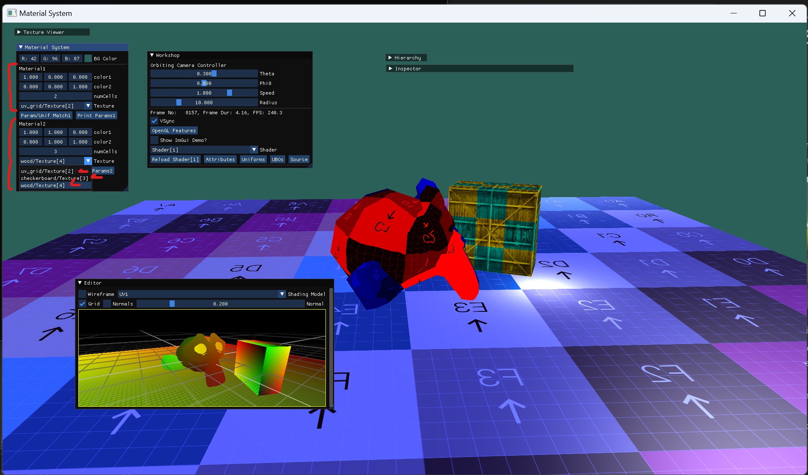
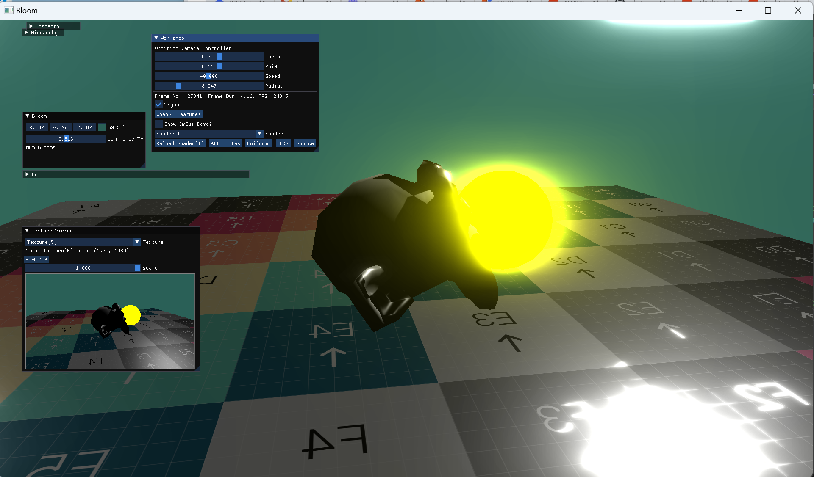
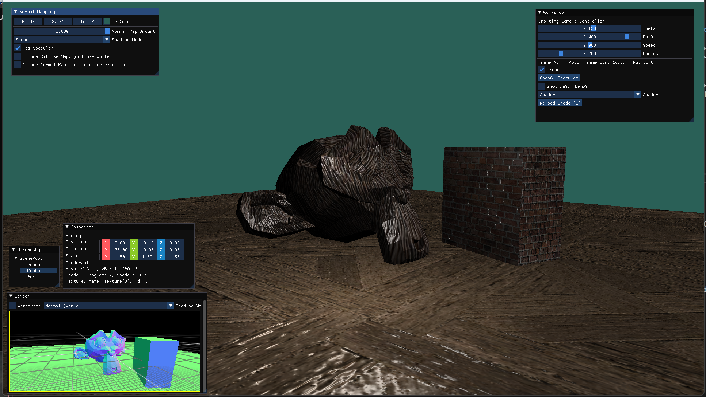

# Example Projects

# 14 - Material System

Before this example, a `Renderable` object had one shader, and two textures. 
Shader uniforms were uploaded manually by using the `Shader.setVector3()` etc API.
It was very limited and manual.

With Material system, a Material class is introduced.
It refers to a Shader, and owns a map, named `parameters`, from uniform names to a variant of types such as int, float, glm::vec2 etc.
Material provides a auto-generated UI to set parameter values. It only uses ImGui's Drag widgets for numeric parameters, and a ComboBox to select textures for Texture parameters.
Material::uploadParameters uses Shader::setX to upload uniform values, and uses Texture::bindToUnit API.

Another novelty that was introduced is the `SceneUniforms`, thanks to the new `UniformBuffer` abstraction.
Scene uniforms are the uniforms that don't change per frame, they hold camera matrices, camera positon, light parameters etc.
A /lib/shader/SceneUniforms.glsl has the struct in glsl, which is in std140 layout.
There is a corresponding C++ struct with padding introduced manually.
There are lots of helper functions to study the layout of uniform interface blocks (aka UBO structs) that prints the uniforms and their offsets etc.
Other helper functions check whether the parameters in the Material match with the non-scene uniforms in the shader.
Assertions can be added for these checks.

This introduces further code-reuse to shaders, and app logic, where we don't need to explicitly upload scene uniforms (light info or camera info) for every shader that is used, manually.

`UniformBuffer` is a templated class, it owns a struct that'll hold whole UBO data as type parameter.
UBO user edits UBOs uniforms struct and calls `upload()`, or can use `map()` method that'll return a reference to uniform struct.

Now, a Renderable is just a reference to a Mesh and a reference to a Material.
Different objects can use the same shader with different parameters, and tweak the parameters in real-time using auto-generated widgets.
Scene Uniforms are uploaded automatically.

# 13 - Bloom

Standard bloom effect. I wanted to test post processing abilities of this project.

* It renders the scene as it is.
* Then, in a framebuffer, calculates brightness for each pixel, and discards the pixel if it is lower than a threshold
* The goes into a loop until framebuffer size becomes very small
  * In a framebuffer, applies gaussian blur. (one pass horizontal, one pass vertical trick)
  * Resizes framebuffer to half
* Once we have all these framebuffers with successively smaller and more blurred versions of original thresholded image, it justs adds up all of them
* Then blends the resulting sum back to the original scene drawing

It would have been better if this effect was implemented in HDR format, with some tone-mapping, because we are adding up samples so many textures per pixel.

# 12 - Normal Mapping

I was first going to follow the normal mapping tutorial on [LearnOpenGL.com](https://learnopengl.com/Advanced-Lighting/Normal-Mapping).
Normal maps are stored in object/local tangent-space and they need to be converted to worl-space.
For that purpose, we need tangent and bi-tangent (bi-normal) vectors that lie on u- and v-directions of the texCoordinates on the surface. (N,T,B vectors make a local, orthonormal coordinate system)
The approach in LearnOpenGL org requires T and B to be pre-calculated, at asset load time, and be stored as one of the vertex attributes (similar to storing vertex normals)
They show the math but suggest to use Assimp library, which does the calculation automatically.

Probably in the future I'll go to that direction, but initially I just wanted to do T, B calculation on-the-fly in fragment shader.
Initially I've found this StackOverflow post [math \- How to calculate Tangent and Binormal? \- Stack Overflow](https://stackoverflow.com/questions/5255806/how-to-calculate-tangent-and-binormal) with some answers.
The result looked mostly good, however, at certain viewing angles the normals started flipping. :-O
Couldn't tell whether I made a mistake by implementing the suggestions in SO post, or the suggestions were wrong.

Searching deeper, found this blog post [Followup: Normal Mapping Without Precomputed Tangents \| The Tenth Planet](http://www.thetenthplanet.de/archives/1180).
That was the ultimate source for calculating T,B,N coordinate system in the shader!

Added extra 

# 11 - Rendering Cookbook - Infinite Grid

Implementation of [Chapter5/GL01\_Grid/src/main\.cpp at master · PacktPublishing/3D\-Graphics\-Rendering\-Cookbook](https://github.com/PacktPublishing/3D-Graphics-Rendering-Cookbook/blob/master/Chapter5/GL01_Grid/src/main.cpp) from [3D Graphics Rendering Cookbook \| Packt](https://www.packtpub.com/product/3d-graphics-rendering-cookbook/9781838986193) in graphics-boilerplate-app.

* Procedurally generate an "infinite quad" that follows camera's projection onto xz-plane in vertex shader
* In fragment shader draw anti-aliased lines of 3 LODs.
* Uses `fwidth(p2D)` for determining LODs and anti-aliasing a lot. 
* also reduce alpha when grid is far away, both for visual appealing and prevention of Moire patterns at distance.

# 10 - UV-Atlas generation and Lightmaps

## Atlas Generation
After a scene is loaded can generate a UV atlas using https://github.com/jpcy/xatlas.
There is a GUI to tweak XAtlas parameters. 

Observed that, if input mesh UVs are not given to XAtlas, generated UVs are too scattered and seams causes visual artifacts

## Scene export
Export whole scene as a single OBJ file, file contains all the meshes, where atlas UVs are stored in uv attribute and world positions are stored in position attribute (i.e. "scene UVs" and transforms are "baked" with the export)
Export UV2s of all meshes into a binary custom formatted file.

## Light baking in Blender

* Import OBJ in Blender.
* Adjust lighting: I used "Sky Texture" with dramatic sunrise lighting.
* Bake via [Render Baking — Blender Manual](https://docs.blender.org/manual/en/latest/render/cycles/baking.html)

## Rendering w/Lightmap

To render the scene with the baked lightmap, once scene is loaded, 
* load UV2s from custom binary file and replace existing UVs
* assign lightmap shader instead of original shaders
* bind lightmap texture from blender

# 09 - LearnOpenGL - ShadowMaps

Implementation of [LearnOpenGL \- Shadow Mapping](https://learnopengl.com/Advanced-Lighting/Shadows/Shadow-Mapping) in graphics-app-boilerplate.

* First, draws depth buffer from directional light source's view in orthographic projection into an offscreen depth-onlyFramebuffer called shadowmap
* the lighting calculations in the shaders have a shadow logic, which 
  i. calculates the distance of the surface to the light,
  i. compares that to the distance stored in the shadow map (requires vertex positions to be transform into Light-space),
  i. if stored value in closer than that fragment is in shadow

Requires extra care for fragments that are outside of the "light camera"s view plane, z-fighting of a surface with itself (aka shadow acne) etc.

# 08 - LearnOpenGL - Cubemaps

Implementation of [LearnOpenGL \- Cubemaps](https://learnopengl.com/Advanced-OpenGL/Cubemaps) in graphics-app-boilerplate.

Two ways of drawing a skybox via cubemap:
* First draw skybox, then draw scene. Some pixels will be drawn twice
* First draw the scene, store depth, draw skybox after, only for unoccupied pixels

Also introduces a reflective+refractive shader to use the environment map to create glassy refractive and metallic reflective surfaces (still unlit)

Observe that the "refraction" just displays the skybox on the surface of the object. So, if the container is behind the teapot, it's not visible. This is not true transparency. 

# 07 - Outlines via "Growth"

An alternative to the previous app. This time the outline is done via

* Draw the scene to screen
* Draw highlighted objects offscreen with a solid color shader
* Blit above texture into another offscreen one, via a shader that makes everywhere transparent except the pixels whose colored neighbor count N satisfies 0 < N < 8.
* Blit above texture to screen with blending on

With this technique no artifacts due to scaling up models occurs!

# 06 LearnOpenGL - Stencil Testing for Outlines

Implementation of [LearnOpenGL \- Stencil testing](https://learnopengl.com/Advanced-OpenGL/Stencil-testing) in graphics-app-boilerplate.
Observe the uneven thickness of the outline.

# 05 Sand Automata via Margolus Neighborhoods

Cellular automata for 2D falling sand simulation.

See following for explanations

* [Block cellular automaton \- Wikipedia](https://en.wikipedia.org/wiki/Block_cellular_automaton)
* [Reversible cellular automata simulator: help page](https://dmishin.github.io/js-revca/help.html)

# 04 CUDA Mandelbrot

Draws Mandelbrot and Julia sets via CUDA. Can pan and zoom-in.

When using 32-bit floats the zoom-in limit is about 10^-6. (height side corresponds an interval of 4.1e-6)

Using doubles (64-bit floating points) fixes the discritization/pixellation problem at the same zoom-level

With doubles we can go down way further. Here height side corresponds to an interval of 3.1e-14 or something.

Enjoy zooming in and out multiple orders of magnitude

# 03 First CUDA app

First CUDA app prepared via CMake. 
Project structure is such that CUDA code is compiled into a static library.
Which later is linked to C++ app code.

Introduction `launchKERNEL_NAME` code organization in `kernels.h` so that C++ does not involve any C++ CUDA extensions such as `<<<n,m>>>` syntax that causes an error to be reported in Visual Studio.

# 02 Triangle (Without VBO)

Draws The Triangle without any meshes, just shaders

# 01 Clear Window

Simplest app, just clear the window with a solid color which can be set via an ImGui ColorPicker

